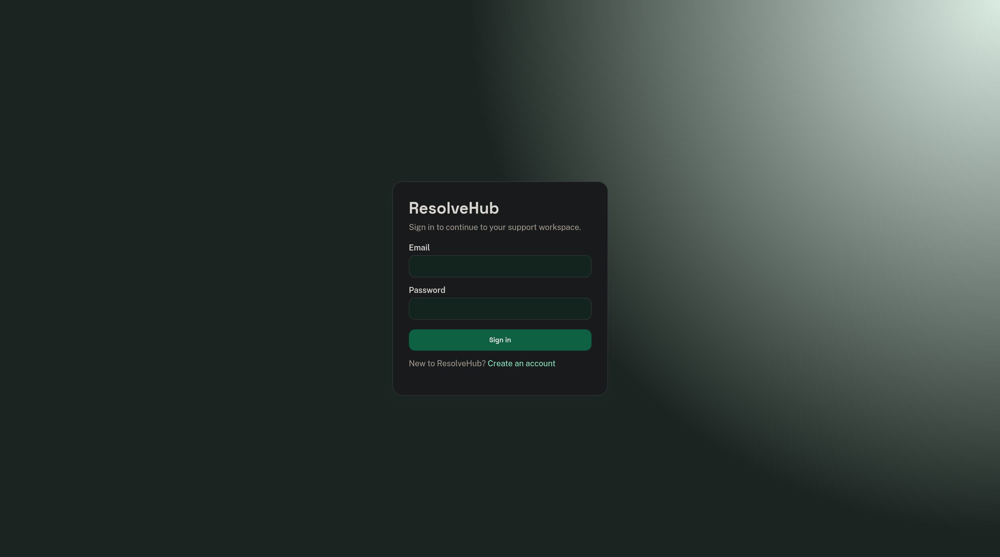
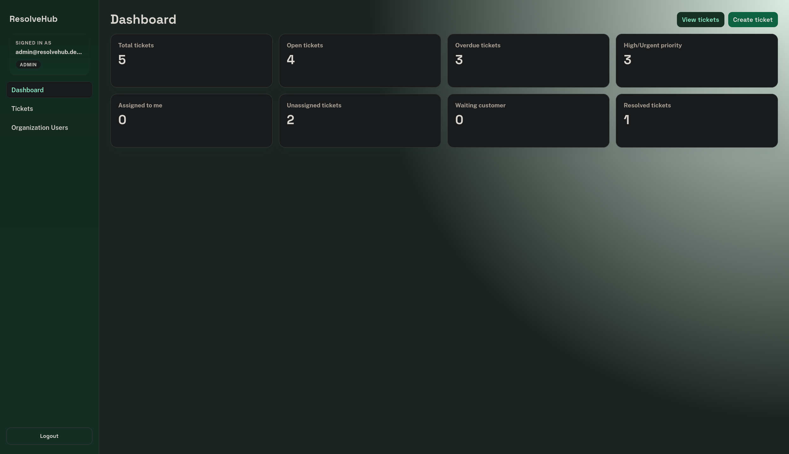
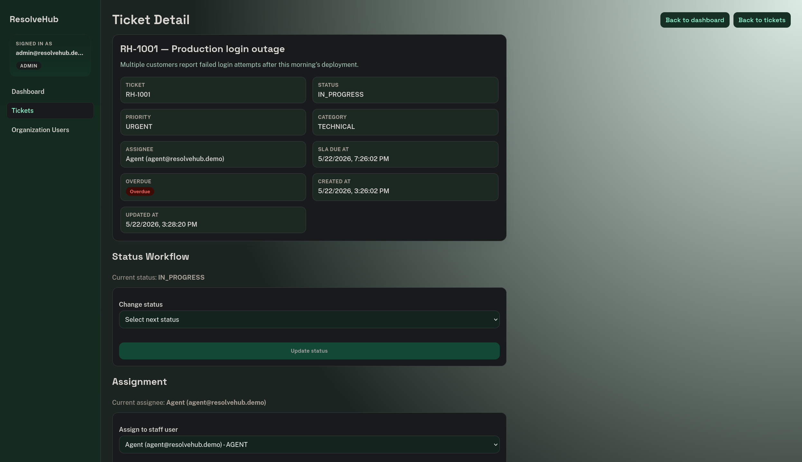
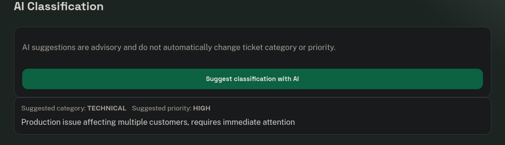
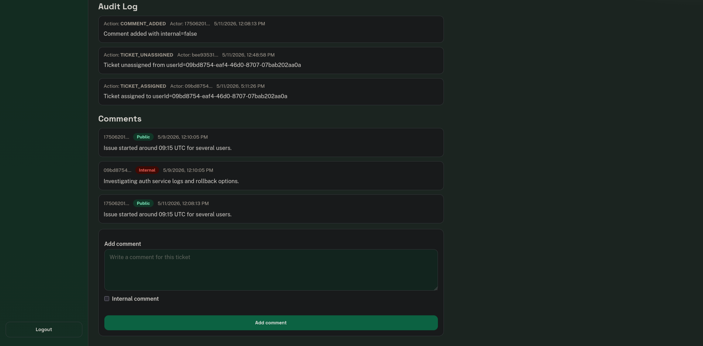

# ResolveHub

ResolveHub is a portfolio-ready full-stack customer support ticket platform. It demonstrates backend architecture, security, product workflows, testing discipline, and deployment readiness.

## Live Demo

- Frontend: https://resolvehub-frontend.onrender.com
- Backend health: https://resolvehub-0ssp.onrender.com/actuator/health
- API docs: https://resolvehub-0ssp.onrender.com/swagger-ui/index.html

Note: the hosted backend may take a moment to wake up on the first request.

## What This Project Demonstrates

- Organization-based multi-tenancy
- Role-based access control with JWT authentication
- Ticket workflow management (creation, status transitions, assignment, comments)
- SLA deadline calculation and overdue tracking
- Append-only audit logging for ticket lifecycle events
- AI-assisted ticket classification through a provider abstraction
- CI validation with backend/frontend tests and Docker image builds

## Implemented Features

- Organization-based multi-tenancy
- JWT authentication and role-based access control
- Ticket creation, listing, detail view, and status workflow
- Ticket comments (public/internal rules by role)
- Ticket assignment with role constraints
- SLA deadline calculation and overdue detection
- Ticket audit logs
- AI-assisted ticket classification (advisory suggestions)
- Manual apply workflow for AI category/priority suggestions
- Ticket search and filtering (search, status, priority, category, overdue)
- Dev demo data seeding
- CI with GitHub Actions

## Demo Walkthrough

This walkthrough highlights portfolio-relevant product behavior, including role-aware UI, ticket workflow controls, SLA visibility, auditability, and AI-assisted classification.

1. Login screen
   
   Role-based access starts at authentication and directs users into their permitted workflow.
2. Dashboard with ticket metrics
   
   The dashboard summarizes operational state across tickets, including priority and SLA context.
3. Ticket detail with workflow, SLA, assignment, and metadata
   
   Ticket operations are role-aware, with status workflow and assignment bounded by backend authorization rules.
4. AI classification suggestion
   
   AI suggestions provide advisory category/priority guidance without auto-applying ticket changes.
5. Audit log and comments
   
   Audit logs and comments provide a clear, chronological trace of ticket communication and lifecycle actions.

## Role Behavior

- `CUSTOMER`: creates tickets and views/comments on own tickets
- `AGENT`, `MANAGER`, `ADMIN`: manage tickets in their organization

## Tech Stack

Backend:
- Java 21
- Spring Boot 3
- Spring Security + JWT
- Spring Data JPA + Hibernate
- PostgreSQL
- Flyway
- springdoc OpenAPI/Swagger
- JUnit 5 + Testcontainers

Frontend:
- React 18
- TypeScript
- Vite
- Vitest

Infrastructure:
- Docker Compose
- GitHub Actions

## Architecture Overview

- React frontend calls a secured Spring Boot API.
- JWT carries user id, organization id, and role claims.
- Backend enforces authorization and organization scoping.
- PostgreSQL stores organizations, users, tickets, comments, and audit logs.
- AI classification is provider-agnostic (`fake` by default, OpenAI-compatible optional).

See [docs/architecture.md](docs/architecture.md) for details.

## Local Setup

### Prerequisites

- Java 21
- Node.js 22+ and npm
- Docker + Docker Compose

### 1) Start infrastructure

```bash
docker compose up -d db
```

Optional (for local AI provider testing):

```bash
docker compose up -d ollama
```

### 2) Run backend

```bash
cd backend
./mvnw spring-boot:run
```

Backend runs on `http://localhost:8080`.

Swagger UI (dev profile): `http://localhost:8080/swagger-ui.html`

### 3) Run frontend

```bash
cd frontend
npm install
cp .env.example .env
npm run dev
```

Frontend runs on `http://localhost:5173`.

## Run Tests

Backend:

```bash
cd backend
./mvnw clean verify
```

Frontend:

```bash
cd frontend
npm test -- --run
npm run build
```

## Docker Compose

Start full app stack (DB + Ollama + backend + frontend):

```bash
docker compose --profile app up --build
```

Notes:
- App services in Compose run with Docker profile configuration.
- If you want backend AI classification to use Ollama, set `RESOLVEHUB_AI_PROVIDER=openai-compatible` for the backend environment.

## Demo Credentials

When running backend with default `dev` profile, demo data is seeded:

- `admin@resolvehub.dev` / `Password123!`
- `manager@resolvehub.dev` / `Password123!`
- `agent@resolvehub.dev` / `Password123!`
- `customer@resolvehub.dev` / `Password123!`

## AI Behavior

- AI suggestions are advisory only.
- Suggestions do not automatically update ticket category or priority.
- `fake` provider is default.
- OpenAI-compatible provider can be enabled for Ollama (`http://127.0.0.1:11434/v1`).

See [docs/ai-provider-design.md](docs/ai-provider-design.md).

## CI Status

GitHub Actions workflow: [`.github/workflows/ci.yml`](.github/workflows/ci.yml)

Current CI jobs:
- repository validation
- backend build and tests (`./mvnw clean verify`)
- frontend build and tests (`npm run build`, `npm test -- --run`)
- backend Docker image build validation
- frontend Docker image build validation

## Documentation

- Architecture: [docs/architecture.md](docs/architecture.md)
- AI provider design: [docs/ai-provider-design.md](docs/ai-provider-design.md)
- Testing strategy: [docs/testing-strategy.md](docs/testing-strategy.md)
- Deployment notes: [docs/deployment.md](docs/deployment.md)
- Release readiness: [docs/v1.0.0-readiness-checklist.md](docs/v1.0.0-readiness-checklist.md)

## Roadmap

- Deployment automation / CD
- Ticket list pagination and server-side filtering
- Production-ready frontend/API integration tests
- Production hardening (observability, secrets management, security controls)
